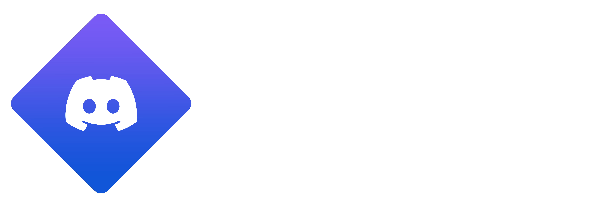

# StremioRPC

<p align="center">
  
</p>

<p align="center">Show what you are watching in Stremio as Discord Rich Presence.</p>

<p align="center">
  
  
  
  
  
  
</p>

StremioRPC is a desktop companion that runs a small local Stremio add-on and sends playback information to Discord Rich Presence. Start a movie or an episode and Discord will show the title, season, episode, and elapsed time.

There are no API keys or Discord IDs for users to configure. The application uses the shared StremioRPC Discord application and OMDb fallback key out of the box.

## Features

- Displays Stremio movies and series in Discord Rich Presence.
- Resolves titles through Cinemeta, with the project OMDb key as a fallback.
- Installs the local Stremio add-on from the app.
- Runs quietly in the system tray or macOS menu bar.
- Starts at login when enabled.
- Clears stale Discord activity when Stremio is no longer available.
- Packages for macOS, Windows, and Linux.

## Requirements

- [Discord Desktop](https://discord.com/download) must be open. Discord Rich Presence uses the local desktop client; Discord Web, mobile, and console clients are not supported.
- [Stremio Desktop](https://www.stremio.com/downloads) must be installed.

On Linux, use a Discord package that supports local IPC. The Flatpak build may not expose the socket needed by Discord Rich Presence.

## Install and use

1. Download and install the release for your operating system.
2. Open StremioRPC. It connects to Discord automatically.
3. Click **Install Addon on Stremio** once and confirm the prompt in Stremio.
4. Start watching in Stremio.

That is all the setup required. You can enable **Run on Boot** and **Close to Tray** in the app so the companion stays available without being opened manually.

The add-on is local-only and is served at `http://localhost:7000`; no playback information is sent to a StremioRPC server.

## Platform packages

| Platform | Release files | Notes |
| --- | --- | --- |
| macOS | `.dmg` and `.zip` | Build `arm64` for Apple Silicon and `x64` for Intel. The app includes a native `.icns` icon and menu-bar behavior. |
| Windows | NSIS `.exe` installer | Creates Start Menu and desktop shortcuts. |
| Linux | `.AppImage` and `.deb` | The AppImage is portable; the `.deb` targets Debian/Ubuntu-based distributions. |

### macOS

Open the appropriate `.dmg`, drag **StremioRPC** to **Applications**, then open it. If an unsigned development build is blocked, use **System Settings > Privacy & Security > Open Anyway**.

### Windows

Run the NSIS `.exe` installer and launch StremioRPC from the Start Menu. Windows SmartScreen may show a warning for unsigned builds.

### Linux

For Debian/Ubuntu:

```bash
sudo apt install ./StremioRPC-*.deb
```

For the portable AppImage:

```bash
chmod +x StremioRPC-*.AppImage
./StremioRPC-*.AppImage
```

## Settings

| Setting | Description |
| --- | --- |
| Run on Boot | Starts StremioRPC with your system. On macOS it starts hidden in the menu bar. |
| Close to Tray | Keeps StremioRPC running in the tray/menu bar when its window is closed. |

Settings are saved in the system application-data directory as `config.json`. They contain only local behavior preferences; neither a Discord Client ID nor an OMDb key is stored per user.

## Development

Use a current Node.js LTS release and npm.

```bash
git clone https://github.com/bryanrafaelbueno/StremioRPC.git
cd StremioRPC
npm ci
npm start
```

## Build packages locally

Build output is written to `dist/`, which is intentionally not committed to Git.

```bash
# Current operating system
npm run dist

# macOS
npm run dist:mac
npm run dist:mac:arm64
npm run dist:mac:x64

# Windows and Linux
npm run dist:win
npm run dist:win:x64
npm run dist:linux
npm run dist:linux:x64
```

For reliable Windows and Linux release packages, use their matching GitHub Actions runners instead of cross-building from another operating system. The included release workflow does this automatically.

## Publishing a release

The repository includes [`.github/workflows/release.yml`](.github/workflows/release.yml). Pushing a version tag matching `v*` builds all platforms and creates a GitHub Release with these assets:

- macOS Apple Silicon `.dmg` and `.zip`
- macOS Intel `.dmg` and `.zip`
- Windows x64 NSIS installer
- Linux x64 `.AppImage` and `.deb`

Before the first release, open **GitHub repository Settings > Actions > General > Workflow permissions** and select **Read and write permissions**. Then commit your changes, choose a new semantic version, and push its tag:

```bash
git add .
git commit -m "Release v1.0.1"
git push origin main
git tag v1.0.1
git push origin v1.0.1
```

Open the **Actions** tab to follow the build. When it succeeds, the new GitHub Release and its downloads appear under **Releases**. Use **Run workflow** from the same Actions page for a build-only test; it does not publish a release.

### Code signing

The automated workflow creates unsigned packages unless signing credentials are configured. For public distribution, add Windows code signing and Apple Developer ID signing/notarization before publishing broadly; this prevents SmartScreen and Gatekeeper warnings.

## Project structure

```text
StremioRPC/
├── .github/workflows/release.yml  # Cross-platform release automation
├── Assets/                        # Logos and platform icons
├── scripts/postinstall.js         # Electron runtime preparation
├── index.js                       # Main process, local add-on, and system integration
├── metadata.js                    # Title resolution and cache
├── preload.js                     # Secure renderer IPC bridge
├── renderer.js                    # Dashboard state and actions
├── index.html                     # Dashboard UI
├── package.json                   # Dependencies, scripts, and builder configuration
└── README.md                      # Documentation
```

## Troubleshooting

**Discord shows “Connection failed”**

Open the Discord Desktop app, then restart StremioRPC. Confirm that activity sharing is enabled in Discord. On Linux, use a native Discord package rather than Flatpak if IPC is unavailable.

**Playback does not appear**

Use **Install Addon on Stremio** from StremioRPC and confirm the installation in Stremio. Check that the dashboard reports the add-on as running on port 7000.

**An IMDb ID appears instead of a title**

Cinemeta and OMDb could not resolve that media item. Check your Internet connection and try another item.

**Closing the window does not quit the app**

This is expected while **Close to Tray** is enabled. Use **Quit** from the tray or menu-bar menu to fully stop it.

## License

Released under the [MIT License](LICENSE).
